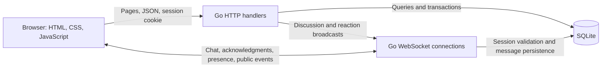

# Yaplane Live: Real-Time Forum & Messaging Platform

A full-stack community platform built with **Go, SQLite, and vanilla JavaScript**. Yaplane Live combines public discussions with private messaging, live presence, and moderation in a responsive single-page interface.

The project demonstrates HTTP API development, relational data modeling, cookie-based authentication, concurrent WebSocket communication, and transactional persistence.

## Features

### Discussions

- Public feed and individual discussion pages.
- Post creation with one or more categories: science, technology, art, sport, and games.
- Replies and likes/dislikes on posts and comments.
- Server-side search across titles, content, and authors, category filtering, and latest/most-liked sorting across all posts.
- Paginated feed with ten discussions per page and previous/next controls.
- Live post, reply, reaction, and deletion updates for signed-in members and guests.
- Author-only deletion, enforced on the backend.

### Private messaging

- WebSocket messaging with persistent SQLite conversation history.
- Offline messaging: messages are saved even when the recipient is disconnected.
- Sender acknowledgment after the database transaction commits; the interface keeps an unconfirmed draft instead of displaying it as successfully sent.
- Client-generated message IDs prevent duplicate storage when retrying the same send.
- Typing indicators, incoming-message notifications, and online/offline presence.
- Multiple connections per account, with presence retained until the last connection closes.
- History loaded ten messages at a time using an ID cursor, so newer arrivals do not shift older history pages.
- Automatic reconnection and refresh of the current discussion or conversation.

### Accounts, moderation, and interface

- Registration and username/email login with bcrypt password hashing.
- Independent 24-hour sessions for different browser profiles/devices.
- HttpOnly, SameSite=Strict session cookies; browser session tokens are not stored in JavaScript-accessible storage or included in WebSocket URLs.
- Expiry checks on protected HTTP actions, WebSocket handshakes, incoming events, and private deliveries.
- Profile details restricted to the account owner.
- Discussion reporting and a moderator queue to dismiss reports or remove discussions and their replies.
- Persistent audit records for moderator actions.
- Responsive layouts, persistent light/dark themes, keyboard focus indicators, a skip link, and reduced-motion support.
- Loading, empty, error, and retry states; user content is escaped or rendered with `textContent`.

## Technology stack

| Layer | Implementation |
| --- | --- |
| Server | Go 1.27.1; `net/http`, `encoding/json`, and `database/sql` |
| Database | SQLite through `github.com/mattn/go-sqlite3` v1.14.52; CGO |
| Real-time transport | `github.com/gorilla/websocket` v1.5.3 |
| Password hashing | `golang.org/x/crypto/bcrypt`, from `x/crypto` v0.57.0 |
| Session identifiers | `github.com/google/uuid` v1.6.0 |
| Frontend | HTML, CSS, native JavaScript modules, and inline SVG icons |
| Deployment | Multi-stage Docker image, Docker Compose, and a database health endpoint |

The frontend has no runtime framework or npm dependencies and needs no build step.

## Run locally

### Option 1: Docker

Install Docker with Compose support, then run from the repository root:

```sh
docker compose up --build -d
```

Open **[http://localhost:8080](http://localhost:8080)**. The container runs as a non-root user and initializes a fresh database in a named Docker volume. The database included in the repository is excluded from the image.

```sh
docker compose logs -f forum
docker compose down
```

Stopping the service preserves its named volume. Do not remove the volume if you want to retain accounts, discussions, and messages.

### Option 2: Go and a C compiler

Requirements:

- Go 1.27.1 or later. Older Go launchers with automatic toolchain selection can download the version declared in `go.mod`.
- A C compiler compatible with your Go architecture and CGO enabled.
- A modern browser supporting JavaScript modules and WebSocket.

Check your environment:

```sh
go version
go env CGO_ENABLED CC
go mod download
go run -ldflags="-s -w" .
```

Open **[http://localhost:8080](http://localhost:8080)**. Run from the repository root so the server can find `frontend/`.

The stripped linker flags above were verified with Go 1.27.1 and TDM-GCC 10.3 on Windows/amd64. On this toolchain, an unstripped standalone executable failed to launch; the stripped executable ran successfully. Docker provides an alternative that includes the compiler toolchain.

### Configuration

| Variable | Default | Purpose |
| --- | --- | --- |
| `PORT` | `8080` | HTTP listening port |
| `DATABASE_PATH` | `Real-Time-Forum.db` | SQLite file path; missing parent directories are created |
| `PUBLIC_ORIGIN` | Request scheme and host | Exact browser origin for HTTP mutation and WebSocket origin checks |
| `COOKIE_SECURE` | `false` | Set to `true` behind an HTTPS reverse proxy; direct TLS requests also set Secure cookies |
| `ADMIN_USER_IDS` | Empty | Comma-separated account IDs with moderator access |
| `HOST_PORT` | `8080` | Docker Compose host port; native Go runs use `PORT` |

PowerShell example using a separate local database:

```powershell
$env:PORT = '8081'
$env:DATABASE_PATH = 'data/forum.db'
go run -ldflags="-s -w" .
```

macOS/Linux:

```sh
PORT=8081 DATABASE_PATH=data/forum.db go run -ldflags="-s -w" .
```

Docker Compose reads an optional `.env` file; copy [.env.example](.env.example) and adjust it. Native Go runs read environment variables directly and do not load `.env`.

The repository contains an existing database with no documented demo credentials. Register your own account. Stop the previous server and back up that database before the updated application first opens it: startup performs repeatable schema migrations, including new indexes, message retry IDs, and moderation tables. Existing accounts, posts, and messages are retained; duplicate legacy reactions are consolidated to their newest record.

For a fresh native database, choose a new `DATABASE_PATH`. The application creates tables and seeds missing default categories automatically.

## Demo walkthrough

1. Browse discussions as a guest. Search, filter by topic, sort by popularity, and navigate feed pages.
2. Register an account, publish a discussion, add a reply, and react.
3. Open a separate browser profile/private context and register a second account. Ordinary tabs share the same account cookie and browser storage.
4. Keep a guest browser open to see public discussion, reply, reaction, and deletion updates.
5. Select the other account from the people panel, type a message, and observe typing indicators and persistence acknowledgments.
6. Close the recipient's page and send another message. Reopen their session to read the saved conversation.
7. Exchange more than ten messages to load earlier history. Open two tabs for one account, then close one to verify that presence remains online.
8. Switch themes and reload. Sign out in one tab to see the shared browser session clear in other tabs.

### Try moderation

Register a trusted moderator account first. Its profile URL contains the numeric account ID, such as `/profile/1`. Set that ID in `ADMIN_USER_IDS`, restart the server/container, and reload the moderator's page.

Signed-in members can select **Report discussion** on a post. Moderators receive a **Moderation** navigation link and can dismiss a report or remove its discussion. Authorization is checked on the server; changing the browser's cached interface state does not grant moderator access.

## Architecture



### Technical decisions

- **One application and origin:** Go serves static assets, JSON endpoints, and WebSocket connections. The browser needs no separate development server.
- **Cookie authentication:** the frontend confirms its identity through `/check-auth`. Local storage contains only UI information such as account ID, username, moderator-link visibility, and theme preference. The server makes authorization decisions independently.
- **Transactions and constraints:** registration plus session creation, posts plus categories, reactions, message persistence, and moderation actions use transactions. Partial unique indexes enforce one reaction per user/target and one stored message per sender/client ID.
- **SQLite connection configuration:** foreign keys, a five-second busy timeout, WAL journaling, and immediate write transactions are configured in the driver's connection string for every pooled connection.
- **Concurrent connections:** a read/write mutex protects connection groups; a per-connection mutex serializes writes. Writes have a ten-second deadline. Heartbeats detect disconnected clients and revalidate sessions.
- **Bounded input:** JSON bodies are limited to 16 KiB and reject unknown fields or multiple objects. IDs, pagination, categories, credentials, and text lengths are validated.
- **Abuse controls:** process-local rate limiting permits 240 dynamic HTTP requests per IP/minute and 20 combined registration/login attempts per IP/15 minutes. Static assets are exempt. Messaging/typing is limited to 120 events per account/minute. Connections are capped at eight per account and 1,000 overall.
- **Browser protections:** same-origin mutation/handshake checks, Strict cookies, Content Security Policy, frame restrictions, and content-type protections accompany escaped text rendering.

Post titles accept 1–200 characters, post bodies 1–2,000, replies 1–200, and private messages 1–2,000. Registration accepts usernames of 3–32 ASCII letters/numbers/dots/underscores/hyphens and passwords of at least eight characters and at most 72 bytes.

### Data model

| Table | Purpose |
| --- | --- |
| `users` | Account information and password hashes |
| `sessions` | Account sessions and expiry timestamps |
| `posts` | Discussions, authors, and timestamps |
| `categories` / `post_categories` | Topics and their many-to-many relationship with posts |
| `comments` | Discussion replies |
| `likes` | Post/comment reactions |
| `messages` | Conversations, read status, and retry IDs |
| `reports` | Member reports awaiting moderator review |
| `moderation_actions` | Audit records retained after report resolution |

Presence is determined from active server connections rather than relying on a potentially stale database flag. Foreign keys cascade discussion deletion to its replies, reactions, category links, and reports.

## API overview

| Method | Endpoint | Purpose |
| --- | --- | --- |
| `POST` | `/register`, `/login`, `/logout` | Account/session management |
| `GET` | `/check-auth` | Current account ID, username, and moderator status |
| `GET` | `/posts?q=&category=&sort=newest&limit=10&offset=0` | Search, filtering, sorting, and paginated feed |
| `GET` | `/post/{id}` | Discussion HTML or JSON depending on `Accept` |
| `POST` | `/create_post`, `/delete-post` | Create or delete an owned post |
| `GET` | `/categories`, `/comments?post_id={id}` | Topics and discussion replies |
| `POST` | `/comment`, `/like`, `/comment/like` | Replies and reactions |
| `GET` | `/profile/{id}` | Owner-only profile JSON, or the HTML shell |
| `GET` | `/messages/{id}?limit=10&before={messageId}` | Private history with another account |
| `POST` / `GET` | `/reports` | Submit a report / moderator-only report queue |
| `POST` | `/moderate` | Moderator-only report dismissal or discussion removal |
| `GET` | `/healthz` | Database readiness check |
| WebSocket | `/ws` | Public events for guests; authenticated messaging and presence |

The feed returns `{ posts, total, limit, offset }`. Feed/history limits must be 1–50. History also accepts an offset for API compatibility; the interface uses the `before` cursor. Registration/login set the session cookie and return account information, without a session token in JSON.

API JSON requests use `Content-Type: application/json`. Reaction/deletion requests use form encoding. Post/profile JSON requests use `Accept: application/json`. Historical raw/Bearer `Authorization` tokens remain accepted by the backend, but the browser uses cookies.

## Validation

Run these checks from the repository root:

```sh
go vet ./...
go build -ldflags="-s -w" .
```

The repository contains the application and deployment configuration, with no bundled automated test suite or frontend test dependencies. The frontend runs directly in the browser without an npm install or build step.

## Deployment

The Docker image includes the Go binary and frontend, runs as user `10001`, and exposes `/healthz` for health checks. Compose stores the database under `/data/forum.db` in a named volume and binds its host port to loopback.

For an HTTPS deployment:

1. Run one application instance behind a reverse proxy with TLS and WebSocket upgrade support.
2. Set `PUBLIC_ORIGIN` to the exact external origin, such as `https://forum.example.com`, without a trailing slash.
3. Set `COOKIE_SECURE=true`. Startup rejects an HTTPS `PUBLIC_ORIGIN` without this setting.
4. Persist the database volume, back it up while the service is stopped or through a SQLite-aware backup, and provision moderator IDs.
5. Apply per-client rate limiting at the reverse proxy. The application uses the direct peer IP and does not trust arbitrary forwarded headers.

Changing the Compose host port also requires updating `PUBLIC_ORIGIN` if you use a non-default browser origin. The repository supplies deployment configuration; no public hosting service or domain is provisioned.

## Repository structure

```text
main.go                  HTTP server, configuration, health, and shutdown
database/                Schema, connection configuration, migrations
handlers/                Authentication, validation, discussion/chat/moderation APIs
models/                  Response structures
routes/                  Route registration
frontend/index.html      Shared application shell
frontend/css/            Responsive layouts and themes
frontend/js/             Routing, forms, chat, WebSocket, moderation, UI helpers
Dockerfile / compose.yaml
```

## Remaining scope

- Designed for a **single server instance**. Connection state and rate-limit counters are process-local; multiple instances would need shared event delivery and coordinated limits.
- Search uses parameterized SQLite substring queries, with SQLite's default case-folding behavior, rather than a full-text index. Offset-based feed pages can shift when discussions are added or removed.
- A persistence acknowledgment confirms storage, not that the recipient has read a message. There are no read-receipt events, push notifications, or end-to-end encryption.
- Moderation currently covers reported discussions and removal of their replies; account suspension and automated content filtering are not implemented.
- Load testing, a full accessibility audit, and non-Chromium browser verification remain outside the verified checks.

These boundaries describe the current implementation without claiming an audited production service or unsupported scale.
